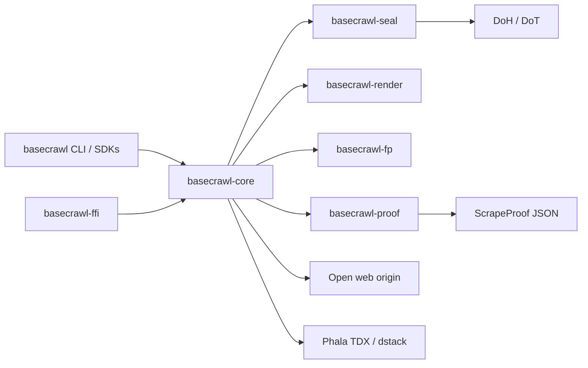

> **Canonical repository:** [github.com/Basecrawl/basecrawl](https://github.com/Basecrawl/basecrawl).  
> [BaseIntelligence/basecrawl](https://github.com/BaseIntelligence/basecrawl) is a **read-only mirror**.  
> Prefer issues and pull requests on the Basecrawl org. crates.io package names are unchanged.  
> See [MIRROR.md](MIRROR.md) for the dual-push / mirror policy.

<div align="center">

# basecrawl

**Verifiable web scraping with cryptographically-anchored scrape evidence.**

<a href="docs/architecture.md">Architecture</a> ·
<a href="docs/SECURITY.md">Security</a> ·
<a href="docs/TRUST_MODEL.md">Trust model</a> ·
<a href="docs/operators/install-and-publish.md">Install & publish</a> ·
<a href="docs/operators/deploy.md">Deploy</a> ·
<a href="docs/operators/proxy-and-egress.md">Proxy & egress</a> ·
<a href="docs/operators/product-breadth-and-extract.md">Breadth & extract</a> ·
<a href="docs/tcb-inventory.md">TCB inventory</a> ·
<a href="docs/image-rotation-on-cve.md">Image rotation</a>

[](https://github.com/BaseIntelligence/basecrawl/actions/workflows/ci.yml)
[](https://github.com/BaseIntelligence/basecrawl/actions/workflows/publish.yml)
[](https://github.com/BaseIntelligence/basecrawl/actions/workflows/image.yml)
[](https://github.com/BaseIntelligence/basecrawl/blob/main/LICENSE)

</div>

---

## Overview

basecrawl is an Apache-2.0 Rust workspace for platforms that need scrape evidence, not just page body text. It fetches content, captures TLS and render artifacts, and emits a canonical **ScrapeProof** JSON object. An optional Phala TDX path binds scrape hashes into a hardware quote via dstack.

The model is **cryptographically-anchored trust-but-audit**. A verifying quote on an allowlisted measurement is strong evidence that the scrape ran inside a pinned CVM image with bound hashes. It is not a claim of absolute authenticity. Residual risk (including TEE.fail on self-hosted DDR5) is documented in the security docs.

Who it serves: relay/miners and any operator that must prove what was fetched under controlled software and network assumptions. What it is not (forbidden claim / must never product claim): absolute-trust "anonymous" egress, a generic stealth proxy, a CDN, or absolute authenticity.

## Architecture



For crate boundaries, proof fields, and validation layers, see [docs/architecture.md](docs/architecture.md).

## How it works

1. Operator or binding invokes `basecrawl` (or the FFI/Python/Node SDK) with a URL, formats, budgets, and optional task identity.
2. Fingerprint seed (if set) drives deterministic JA3/JA4, headers, UA/viewport/locale, and canvas/WebGL surface.
3. DNS (optional DoH/DoT via seal) and an HTTPS fetch capture TLS and response artifacts; optional headless Chromium handles JS render.
4. The engine assembles request, TLS, response, result, and egress fields into a single canonical `ScrapeProof`.
5. With `--attest`, the CVM asks dstack for a TDX quote whose `report_data` binds scrape hashes and the enclave signing key. Outside a CVM this fails closed (no fabricated attestation).
6. Optional seal/key-release path keeps task and result material content-confidential from the host.
7. Validators (or any verifier) check L1 measurement allowlist match and L2 `report_data` / certificate binding, then score or audit on residual confidence.

## Documentation

| Audience | Guide | Contents |
| --- | --- | --- |
| Engineers | [Architecture](docs/architecture.md) | Crates, ScrapeProof flow, mermaid |
| Operators / reviewers | [Security](docs/SECURITY.md) | Residuals, TEE.fail, operator checklist |
| Operators / consumers | [Install & publish](docs/operators/install-and-publish.md) | Preferred `cargo install basecrawl`, crates list, `@basecrawl/sdk` linux-x64 residual, `v*` → `publish.yml` |
| Operators / miners | [Deploy](docs/operators/deploy.md) | Local CLI, GHCR pull, Phala/dstack CVM, digest pin, secrets inventory (names only) |
| Operators / miners | [Proxy & egress](docs/operators/proxy-and-egress.md) | Universal proxy flags, Oxylabs residential, CapSolver miner key how-to, CF/Akamai residual |
| Operators | [Breadth & extract](docs/operators/product-breadth-and-extract.md) | POST/crawl/map/batch + gated json extract |
| Verifiers | [Trust model](docs/TRUST_MODEL.md) | What a proof means; honesty language |
| Image maintainers | [TCB inventory](docs/tcb-inventory.md) | Measured surfaces and pins |
| Image maintainers | [Image rotation on CVE](docs/image-rotation-on-cve.md) | Digest-pinned rebuild and allowlist swap |

## Install

### Preferred CLI (crates.io)

After a public release, install the thin CLI package:

```bash
cargo install basecrawl --locked
```

That is the preferred install path. Equivalents when needed:

```bash
# same binary via the engine package
cargo install basecrawl-core --bin basecrawl --locked

# from a monorepo checkout (pre-publish / local patches)
cargo install --path crates/basecrawl --locked
# or: cargo build --release --locked --package basecrawl-core --bin basecrawl
```

Hard-path / JS / screenshot scrapes still need a **Chromium (or Chrome) system/runtime residual**
on the host unless you use the CVM image (which pins Chromium). Soft `rustls` scrapes do not.

### Published crates (crates.io)

| Package | Role |
| --- | --- |
| `basecrawl` | Thin CLI install package (**preferred** `cargo install basecrawl`) |
| `basecrawl-core` | Engine library + optional CLI bin |
| `basecrawl-render` | Headless Chromium render path |
| `basecrawl-proof` | ScrapeProof wire types |
| `basecrawl-fp` | Seeded fingerprint generator |
| `basecrawl-seal` | Key-release / DoH / seal helpers |
| `basecrawl-ffi` | C ABI substrate |
| `basecrawl-headless-chrome` | Publishable headless Chrome CDP fork used by render |

Node/Python binding Cargo crates stay **private** (`publish = false`). Full residual notes and
ordered publish topology: [install & publish](docs/operators/install-and-publish.md).

### Node SDK (`@basecrawl/sdk`)

```bash
npm install @basecrawl/sdk
```

**linux-x64 residual only** for the published npm line (`os: ["linux"]`, `cpu: ["x64"]`, single
`basecrawl_sdk.node` ELF). Multi-OS napi prebuilds are not part of this package line. See
[bindings/node/README.md](bindings/node/README.md) and
[install & publish](docs/operators/install-and-publish.md).

### Release tags (`v*` → `publish.yml`)

Pushing a git tag matching **`v*`** (for example `v0.1.0`) runs
[`.github/workflows/publish.yml`](.github/workflows/publish.yml): quality gate, version match
(`vX.Y.Z` equals workspace + npm package versions), ordered crates.io publish
(`basecrawl-headless-chrome` → proof → fp → seal → render → core → ffi → thin `basecrawl`), then
the residual linux npm job. Cargo continuous quality remains
[`ci.yml`](.github/workflows/ci.yml); GHCR remains
[`image.yml`](.github/workflows/image.yml). Secrets use names only (`CARGO_REGISTRY_TOKEN`,
`NPM_TOKEN`); never commit token values.

## Build / run / test

Toolchain is pinned in `rust-toolchain.toml` (`1.96.0`, with `rustfmt` and `clippy`). Workspace edition is `2021`. Local builds leave cargo incremental on by default; Docker image builds force `CARGO_INCREMENTAL=0` for determinism.

```bash
# full workspace check
cargo build

# preferred thin binary packaging (also available via basecrawl-core)
cargo build --release --locked --package basecrawl

# release binary used by the CVM image (core package)
cargo build --release --locked --package basecrawl-core --bin basecrawl

# package-focused tests (prefer these on small machines)
cargo test --package basecrawl-core
cargo test --package basecrawl-proof
cargo test --package basecrawl-seal
cargo test --package basecrawl-fp
cargo test --package basecrawl-render
cargo test --package basecrawl-ffi

# full CI-style suite (needs optional hermetic httpbin for HTTP semantics)
cargo test --workspace --all-features
```

### CLI

`basecrawl` scrapes a single URL and writes **exactly one** canonical `ScrapeProof` JSON object to stdout. On failure it writes `{"error": ...}` to stderr and exits non-zero (no partial proof on stdout).

```bash
# basic scrape (default formats: markdown,metadata)
basecrawl https://example.com/

# formats, budgets, task identity
basecrawl \
  --formats markdown,metadata,rawHtml \
  --task-id JOB-1 \
  --nonce once-abc \
  --timeout 60 \
  --max-body-bytes 10485760 \
  https://example.com/

# headless render
basecrawl --wait-for "#ready" --render-timeout 30 --viewport 1280x800 \
  --screenshot-full-page --screenshot-out /tmp/page.png \
  https://example.com/

# product breadth: POST (soft path), crawl MVP, map-lite, batch
basecrawl --method POST --body '{"q":1}' --header 'Content-Type: application/json' \
  --no-js https://example.com/api
basecrawl --mode crawl --max-crawl-pages 5 --max-depth 1 https://example.com/
basecrawl --mode map --max-urls 50 https://example.com/
basecrawl --mode batch --urls https://example.com/,https://example.org/ --concurrency 2

# universal proxy (set BASECRAWL_HTTPS_PROXY in the environment; never commit credentials)
basecrawl --proxy-class residential --proxy-session s1 --proxy-country US \
  --formats markdown,metadata https://example.com/

# structured json extract is gated (unsupported without extractor / key; never forged success)
basecrawl --formats json --schema '{"type":"object"}' --prompt 'title' https://example.com/

# TEE path: TDX quote + enclave signature via /var/run/dstack.sock
basecrawl --attest --task-id JOB-1 --nonce once-abc \
  --formats markdown,metadata,rawHtml --timeout 60 --no-js \
  https://example.com/
```

Useful flags: `--header`, `--cookie`, `--auth-header`, `--basic-auth`, `--no-js`, `--actions`, `--follow-pagination` / `--max-pages`, `--robots`, `--fingerprint-seed`, `--sign-proof`, `--insecure` (diagnostic only), `--verbose`.

Proxy / hard path: `--proxy`, `--proxy-session`, `--proxy-country`, `--proxy-username-template`, `--proxy-class`, `--difficulty`, `--force-browser`, `--keep-browser-profile`. See [proxy and egress](docs/operators/proxy-and-egress.md). Credentials stay in env/file only.

Extract honesty: `--formats json` with `--json-schema` / `--json-prompt` fails closed without a live extractor (`structured_extraction_unsupported` or `invalid_json_schema`). Optional env keys: `BASECRAWL_EXTRACT_API_KEY` / `OPENAI_API_KEY`. Never fabricates empty success JSON. See [breadth and extract](docs/operators/product-breadth-and-extract.md).

Proof surface (schema version 1) includes `request`, `tls`, `response`, `result`, `egress`, `attestation`, and `sdk_signature`. With `--attest` / `--sign-proof` the proof binds request/cert/transcript/response/result hashes and the Ed25519 public key into TDX `report_data`, then signs the envelope with the enclave key.

Supporting capabilities: seeded fingerprints, universal proxy + Chromium composer, stealth hard-path baseline, soft TLS chrome-impersonate for soft targets only, in-enclave DoH privacy for DNS, landmark RTT echo, sealed task decrypt / result seal, digest-pinned CVM images, and optional CapSolver (`CAPSOLVER_API_KEY` / `BASECRAWL_CAPSOLVER_API_KEY` + `--captcha-solver capsolver`; soft CI never requires a key). Residual risk (proxy is not anonymity, headless/CDP residual, CF/Turnstile/Akamai residual, challenge detect-not-solve default / optional CapSolver not commercial Web Unlocker parity, soft TLS ≠ Chromium wire, TEE.fail) is in [SECURITY.md](docs/SECURITY.md) and [proxy & egress](docs/operators/proxy-and-egress.md) (includes miner CapSolver key how-to and Oxylabs residential rules).

## CVM image

**Primary auto-publish registry (GHCR).** Prefer an immutable **digest** for verification and Phala compose pins. `:latest` is convenience only on default-branch publishes and is not a measurement pin.

```text
# GHCR (primary; published by Actions Image workflow)
ghcr.io/baseintelligence/basecrawl-cvm@sha256:<digest>
ghcr.io/baseintelligence/basecrawl-cvm:sha-<git-sha>   # immutable tag from CI

# Historic alternate pin (digest only; may lag GHCR)
docker.io/mathiiss/basecrawl-cvm@sha256:<digest>
```

| Property | Value |
| --- | --- |
| GHCR repository | `ghcr.io/baseintelligence/basecrawl-cvm` |
| Pin policy | **Digest** (`@sha256:…`) for verification, allowlists, and CVM compose; `sha-<gitsha>` tags for traceability; `:latest` optional convenience only |
| Image CI | [Actions → Image](https://github.com/BaseIntelligence/basecrawl/actions/workflows/image.yml) (`.github/workflows/image.yml`; `GITHUB_TOKEN` + `packages: write`) |
| Cargo quality gate | [Actions → CI](https://github.com/BaseIntelligence/basecrawl/actions/workflows/ci.yml) (independent of registry publish) |
| Placement | TDX CVM on Phala (`kms_type: phala`) |
| Guest OS | dstack `0.5.9` family / slug `dstack-0.5.9-bd369a8c` |
| Socket | `/var/run/dstack.sock` (`Info`, `GetQuote`, related endpoints) |
| Compose / measurements | Under [`image/`](image/) (`docker-compose.yml`, allowlist tools) |
| Operator guide | [docs/operators/deploy.md](docs/operators/deploy.md) |

Pull example (private packages need `docker login ghcr.io` or `gh auth token | docker login …`):

```bash
docker pull ghcr.io/baseintelligence/basecrawl-cvm:sha-<git-sha>
# then re-pin compose to the resolved @sha256:<digest>
```

Validators authenticate a run by L1 measurement allowlist match plus L2 `report_data` binding, not by shipping the binary alone. After a Chromium/OS CVE, rebuild, publish a new immutable digest, and rotate the allowlist per [image-rotation-on-cve.md](docs/image-rotation-on-cve.md).

## Environment and dependencies

- Rust **1.96.0** (`rust-toolchain.toml`)
- Linux/amd64 for the CVM image
- Chromium for hard-path render: supplied inside the CVM Dockerfile; host CLI / SDK needs a compatible browser when JS/hard path is enabled (soft path does not)
- TLS: `rustls` + WebPKI roots; HTTPS for authenticity-capable proofs
- Docker BuildKit for image builds after `image/Dockerfile`
- Optional: Phala / dstack socket for live TDX quotes
- Bindings: Python (PyO3) and Node (N-API) under `bindings/`; published npm package is **linux-x64 residual**

## Repository layout

```text
basecrawl/
├── crates/
│   ├── basecrawl/                  # thin CLI install crate
│   ├── basecrawl-core/             # crawler engine + CLI bin
│   ├── basecrawl-proof/            # ScrapeProof wire types
│   ├── basecrawl-render/           # headless Chromium
│   ├── basecrawl-headless-chrome/  # publishable CDP fork for render
│   ├── basecrawl-seal/             # key-release, DoH, seal/redact
│   ├── basecrawl-fp/               # seeded fingerprints
│   └── basecrawl-ffi/              # C ABI
├── bindings/{python,node,c}/
├── image/                          # Dockerfile, compose, allowlist tools
├── docs/                           # product security + install/ops guides
├── .github/workflows/              # ci.yml, publish.yml (v*), image.yml
├── vendor/headless_chrome/         # historical vendor tree (workspace exclude)
└── Cargo.toml
```

| Path | Role |
| --- | --- |
| `crates/basecrawl` | Thin CLI package for `cargo install basecrawl` |
| `crates/basecrawl-core` | Engine, CLI, fetch, formats, RTT, proof assembly |
| `crates/basecrawl-proof` | Canonical wire types and serialization |
| `crates/basecrawl-render` | Headless Chromium path |
| `crates/basecrawl-headless-chrome` | Publishable headless Chrome CDP fork (`package = basecrawl-headless-chrome`) |
| `crates/basecrawl-seal` | RA-TLS key-release, DoH/DoT, sealed tasks, host-safe redaction |
| `crates/basecrawl-fp` | JA3/JA4, headers, UA/viewport/locale, canvas/WebGL |
| `crates/basecrawl-ffi` | Stable C ABI for language bindings |
| `bindings/{python,node}` | Thin SDK wrappers (Cargo private; npm `@basecrawl/sdk` linux-x64 residual) |
| `image/` | Digest-pinned CVM Dockerfile, compose, measurement tooling |

Historical `vendor/headless_chrome` is workspace-excluded. Public consumers depend on the published
`basecrawl-headless-chrome` fork version, not monorepo path patches.

## License

Apache License 2.0. See [`LICENSE`](LICENSE).
